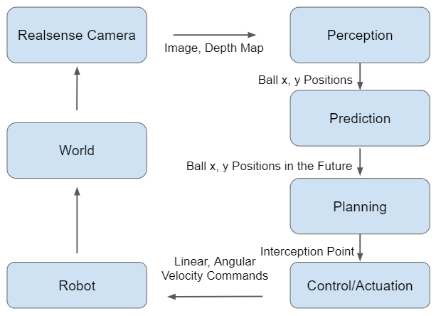

# Project Overview

Imagine a wheeled robot playing soccer. Nearly every action requires the robot to first intercept a rollingball. For example, interception is all that is required for defending a goal. To make a shot on goal or pass to another player the ball must be intercepted and then hit to a target location. In this project, we were able to have a TurtleBot perform that fundamental task of intercepting a rolling ball. We used computer vision to track where the ball was, prediction and planning to find a point for the TurtleBot to intercept the ball, and finally actuation on the TurtleBot to move the TurtleBot to the interception point. 

This is an overview of our closed loop system. 

# Perception

# Prediction

# Planning

# Control and Actuation

# Demos
