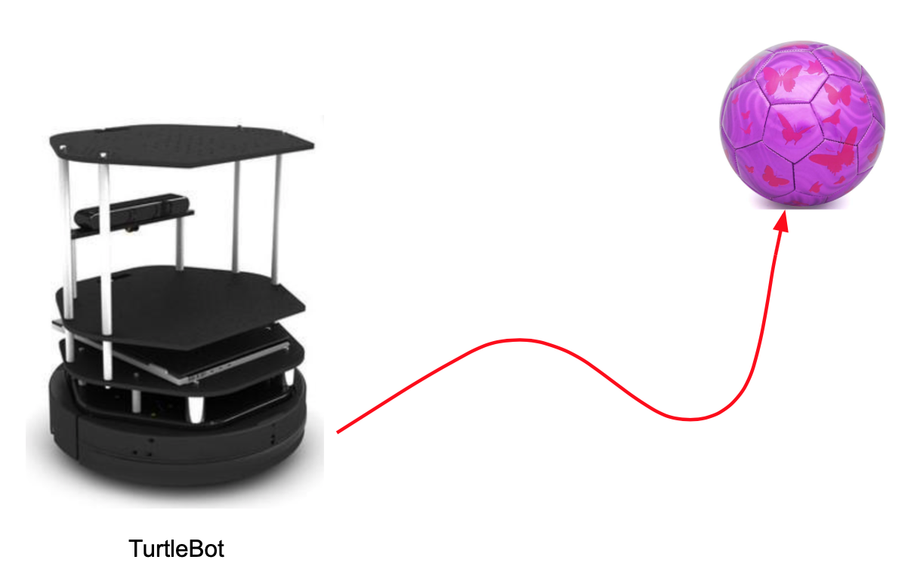
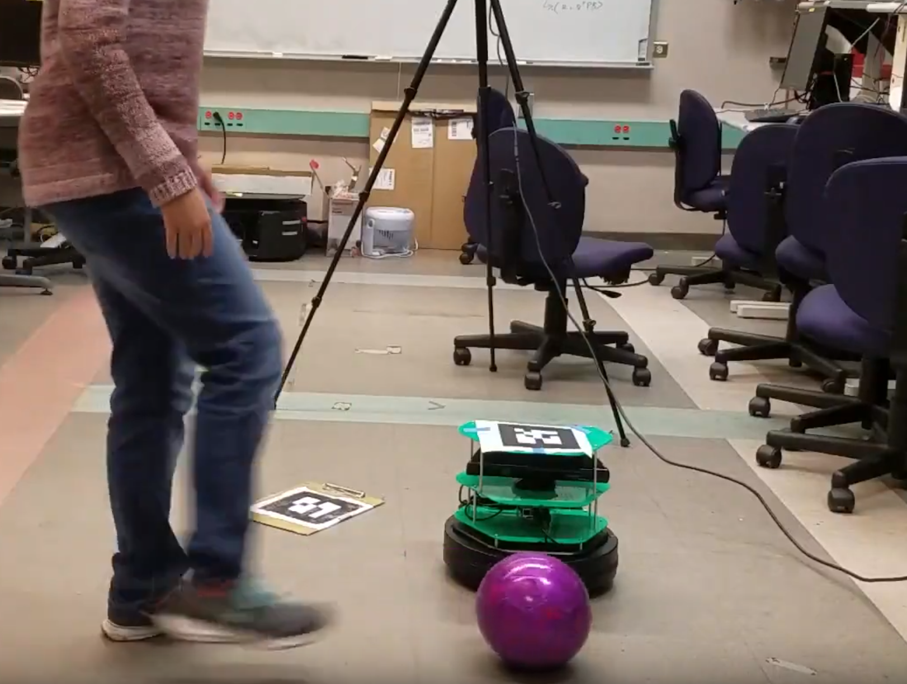
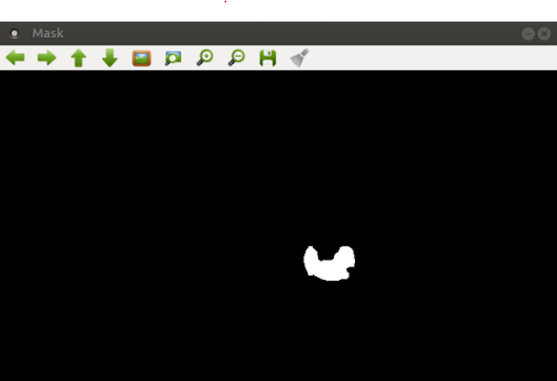
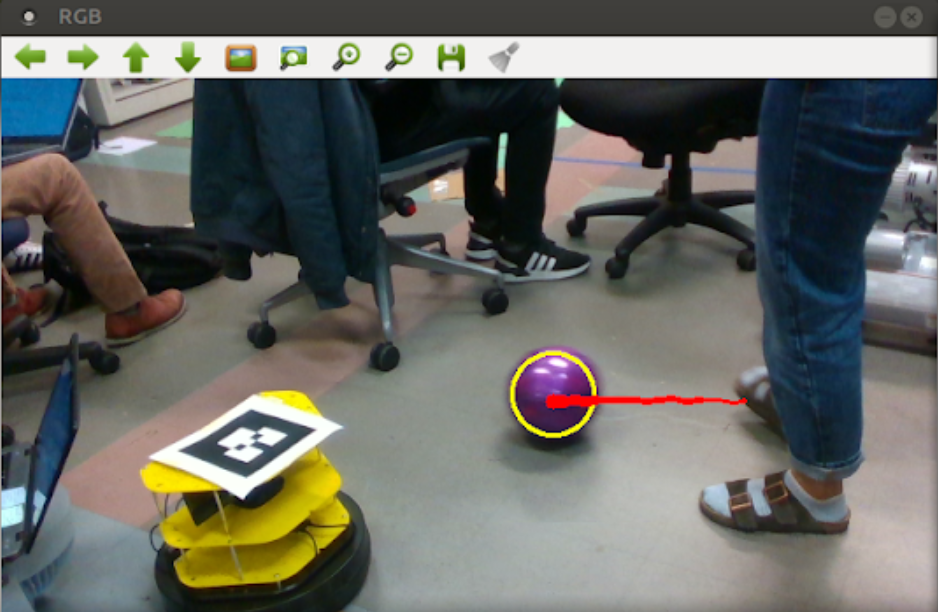
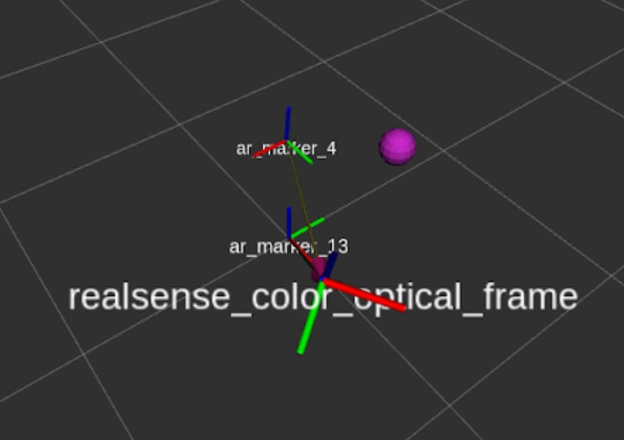
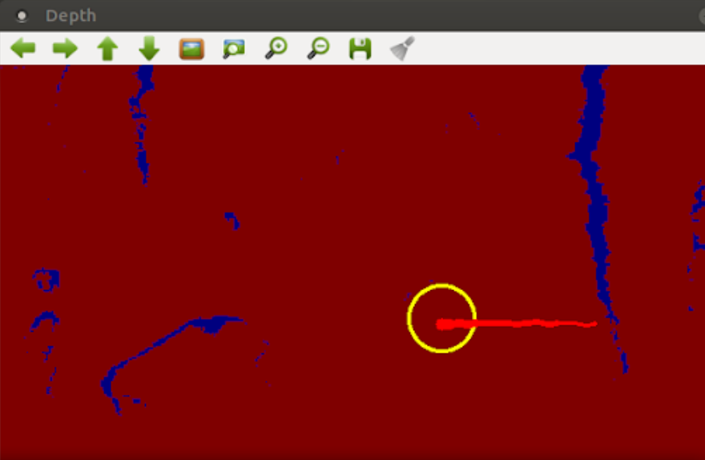

# Project Overview

Imagine a robot playing soccer. Nearly every action requires the robot to first **intercept a rolling ball**. For example, interception is all that is required for defending a goal. To make a shot on goal or pass to another player the ball must be intercepted and then hit to a target location. 

The challenge from this project is to have working perception, prediction, planning, as well as control modules and then to integrate these modules into a full stack. Overall, our approach was one of a **feedback loop** involving this full stack in order to have the robot interact with the ball in real time and also so that our design would be robust to modeling errors. 



Thus, our project is broadly applicable to any robotic domain in a system must perform tasks in dynamic environments and in which vision is a main source of sensing. These environments can not only include moving objects such as the ball in our case, but also other agents, whose motion can also be predicted forward in time with some extension to our work. 


## Autonomy Stack
We split our task into these steps. Our project is organized by having each of these blocks as a distinct ROS package.

1. To detect and track the ball
2. Predict the velocity of the ball
3. Plan an interception point
4. Move the TurtleBot to the desired position

To have our TurtleBot be successful, our modules had to be efficient and accurate, as the ball moved quite fast. 


# Perception

Using the RGB and depth images from a [Intel Realsense 435i camera](https://www.intelrealsense.com/depth-camera-d435i/) we estimated the ball's location.

## RGB Segmentation
We need to determine which pixels correspond to the ball so we applied a gaussian blur to smooth the edges and RGB thresholded to find the purple pixels.

<!-- TODO insert screenshot of thresholder tool -->

### Problem
Other objects in the room like part of the chair cushions or clothing were in the purple range would cause **false positives**. Also sometimes due to sensor noise a random pixel would fall into the RGB range.



### Solution
1. Since the ball is quite reflective and the room has bright lights the color varies dramatically from the top of the ball to the bottom. Instead of using an RGB range that fit the entire ball into the range we used a range that just fit the center of the ball where it is widest. 


2. We performed erosion (removing pixels from boundary) on the mask and then dilation (adding pixels to boundary).  Erosion removes small connected components in the mask and thus eliminates small false positives. Since the RGB range was much tighter the false positives were sufficiently small to be eroded away.

From the mask we found all minimum enclosing circles of the connected components of hot pixels. Then we took the **largest** such circle. This is important because it means that all hot pixels on the ball will be enclosed and small false positives will be eliminated. Since the hot pixels are a strip where the ball is widest the circle fits to the ball quite nicely. 


The yellow circle is our prediction of the ball location. The red contrail is made up of our last twenty predictions. 

Then we get the coordinates of the center pixel of that circle $(u, v)$.
## Point Localization and Depth
If we assume that the image is generated via a pinhole camera model then the following equations describe the relationship between a point in 3D space $(x,y,z)$ in the camera optical frame and the pixel $(u,v)$ it maps to in the image.
$$\begin{bmatrix} u'\\v'\end{bmatrix}=w\begin{bmatrix}u \\ v\end{bmatrix} $$
$$\begin{bmatrix}u'\\v'\\w\end{bmatrix} = K \begin{bmatrix}x\\y\\z\end{bmatrix} $$
Where $K$ is the camera matrix. Note that $K$ is upper triangular with $1$ in the bottom row 
$$K = \begin{bmatrix} f_x & f_y & x_0\\ 0 & f_y & y_0\\ 0& 0 & 1
			\end{bmatrix} $$
thus $w=z$ which is the depth of $(u,v)$ which we can get from the depth image! Thus we can construct $[u', v', w]^{T}$ and solve the linear system for $[x,y,z]^{T}$!


This rviz screen shows all the frames that we had. AR Marker 13 defines the world frame, the pink point is our prediction of where the soccer ball is, and AR Marker 4 is where the TurtleBot is. We can also see the camera optical frame relative to the world frame. 

## Problem
The depth image was very noisy for anything more than about 1.5 meters away. We observed variance of up to a meter on a single point in a stationary frame.

<!-- TODO insert noisy depth image -->

## Solution
1. We read about how the depth camera works. It uses an IR blaster and two IR cameras. In rooms with a lot of harsh lighting (such as the lab room) these sensors can be overexposed. We also read [this doc](https://www.intel.com/content/dam/support/us/en/documents/emerging-technologies/intel-realsense-technology/BKMs_Tuning_RealSense_D4xx_Cam.pdf) on tuning the Realsense and tuned the Realsense parameters for a couple hours until it worked better
2. The depth sensor will sometimes not be able to determine the depth of a point and will output 0. We set the state estimator to ignore these values instead of using them.

We mapped the depths from the depth image onto a red to blue range of colors. The yellow circle is our prediction of the ball location. 

The perception works quite well and if it isn't displaying images will run as fast as it receives images from the camera.


# Prediction

Now that we had estimates of where the ball is we wanted to predict where it is going. We used a linear model of the ball in that we assumed that the ball moves at a constant speed and used the two most recent state estimates to calculate the velocity.

$x_{ball}(t) = x_{0, ball} + v_{x, ball}t$
$y_{ball}(t) = y_{0, ball} + v_{y, ball}t$

## Problem

There is noise in the position estimate. If the position estimate ball moves just a centimeter when it is stationary the velocity estimate will be 0.3 m/s (assuming it runs at 30 Hz). 

## Solution

From a signal processing perspective taking a numerical derivative of a noisy signal amplifies high frequency noise. Thus we implemented a moving average which is a low-pass filter. Intuitively with a noisy signal the variance is high but its mean is close to the true signal assuming the noise is near zero mean. 

## New Problem

This adds a tunable parameter of how big to make the window for the average. A larger window results in lower noise estimates but it will be using older (potentially unrepresentative) data. If the ball suddenly goes out of frame and back in the estimates Another downside is that the window must fill up with values before it can make estimates.

## Solution

We tuned the size of the window to improve this tradeoff and also set a cutoff 

<!-- TODO include graphic here -->


# Planning

The goal of this module is to find the point of interception of the ball and robot. The simple solution we found to this was to assume that the robot moves in a straight line at various nominal speeds. Taking the predictions for where the ball would be for various times up to 1 second into the future, we chose the earliest time that the robot could reach that location. Because new predictions were constantly being generated for new measurements, the robot would be constantly replanning in response to new information about where the ball was and where it was going. 

```
Pseudocode:

Given: Black box predict_ball(t) from prediction module
speeds = [set of possible speeds for the robot]
times = [times from 0 to 1 second]
turtlebot_pt = current location of the robot

for t in times:
    ball_pt = predict_ball(t)
    movement_vector = 
        normalize(ball_pt - turtlebot_pt)
    for s in speeds:
        turtlebot_next_pt = 
            turtlebot_pt + (movement_vector * s * t)
        dist = distance(turtlebot_next_pt, ball_pt)
        if dist < epsilon:
            return turtlebot_next_pt
```


# Control and Actuation

Given the interception point outputted by our planning module, we implemented a simple proportional controller to give the robot a linear and angular velocity control command. We then had to tune our gains accordingly.

### Problem
With our proportional controller, our TurtleBot would not aggressive enough when it got closer to ball. If the TurtleBot slowed down near the ball, it would get close to intercepting the ball, but never actually hitting it.


### Solution
1. To make our controller act more aggressive, we decided to put our error through an arctan function. This would make our controller act more like a smoothed bang-bang controller, because the Turtlebot will be moving close to full speed at most distances away from the ball. 


# Demos
<iframe width="560" height="315" src="https://www.youtube.com/embed/AVnXz0teLzA" frameborder="0" allow="accelerometer; autoplay; encrypted-media; gyroscope; picture-in-picture" allowfullscreen></iframe>

# Conclusion

# Team
### Angela Wang
### Khadijah Flowers
### Neil Lugovoy
### Sampada Deglurkar